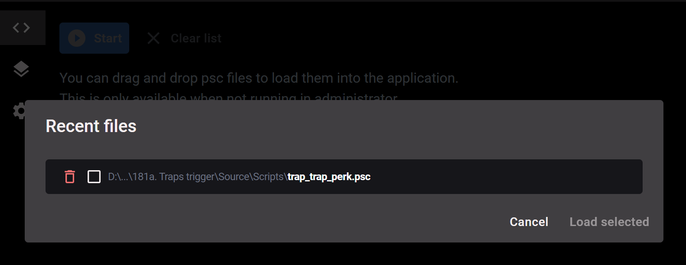

### Features

- Recent compiled files appears in a new section called **"Recent files"**

  You can now add files faster

- App top bar is now draggable
- The "waiting to compile" icon has been deleted

  This icon could show that a compilation was in progress when not

- Application menu bar items are now
  translated (PCA only supports `english` and `french` at the moment, helps are welcome)

- When checking for updates, a message now appear when you're already using the latest version

  

### Bug fixes

- Texts could appear behind scrollable section
- New release dialog could have malformed texts
