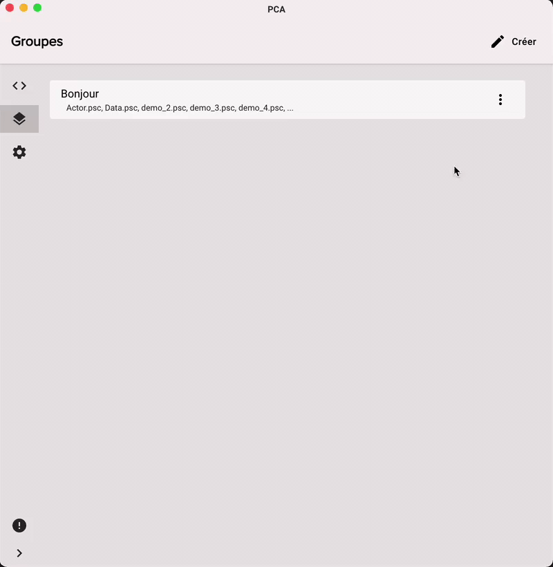
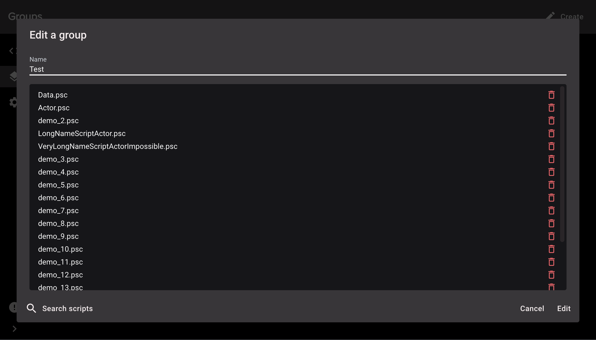

import GithubIssue from "../../src/components/GithubIssue";

- Dialogs can be validated with "Enter" (<GithubIssue issue={119} />)
- Display a preview of a group when you hover the mouse over it (<GithubIssue issue={118} />)

  

### Improvements

- Telemetry event "AppLoaded" now send the application version (<GithubIssue issue={114} />)
- Telemetry are sent in a job queue (<GithubIssue issue={123} />)
- Group dialog is bigger and display more scripts at once (<GithubIssue issue={117} />)

  
