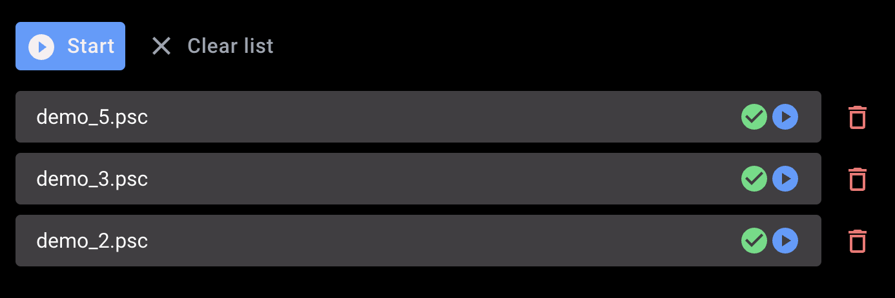
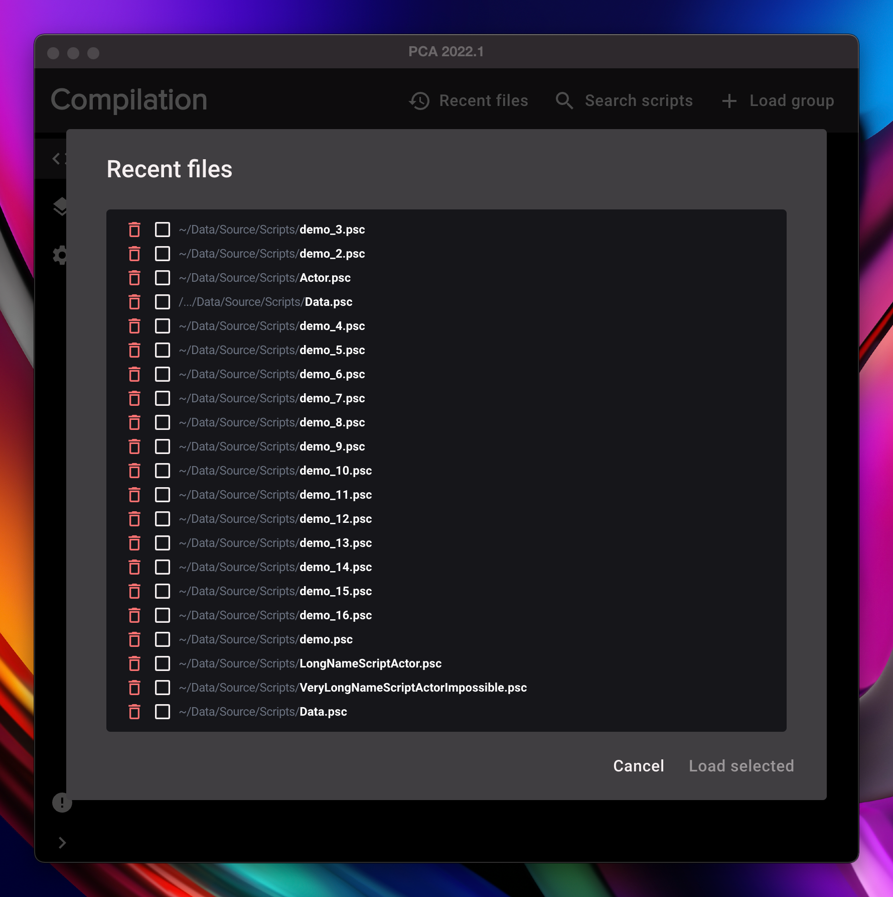
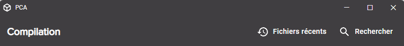

# 2022.1

### Features

- You can now compile the script of your choice from the list

  

- Recent files dialog displays more scripts at once
  
  

- A loading screen now appear when the application start

  

- New application titlebar

  The application menu is now accessible with the application icon at the left

  

  

- The position of the app is now memoized
- Bumps dependencies
- Changelog window correctly displays images
- The application restarts when resetting the configuration

### Bug fixes

- When closing the drawer panel, links could break into multiple lines
