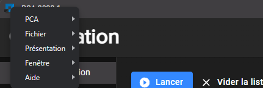

import GithubIssue from "../../src/components/GithubIssue";

# 2022.1

### Features

- The configuration is now checked when you enter the compilation page, giving you any tips if your configuration is wrong (<GithubIssue issue={138} />)

- Button to open compilation logs now changes color at the end of a compilation (<GithubIssue issue={143} />):

  - Green: when all scripts compile successfully
  - Red: when a script gone wrong

- Recent files: option to show the script full path (<GithubIssue issue={130} />)

- Access the documentation via NexusMods or with the new button at the bottom left (<GithubIssue issue={148} />)

  

- You can now compile the script of your choice from the list (<GithubIssue issue={147} />)

  

- Recent files dialog displays more scripts at once
  
  

- A loading screen now appear when the application start

  

- New application titlebar

  The application menu is now accessible with the application icon at the left

  

  

- The position of the app is now memoized
- Bumps dependencies
- Changelog window correctly displays images
- The application restarts when resetting the configuration

### Bug fixes

- When closing the drawer panel, links could break into multiple lines
