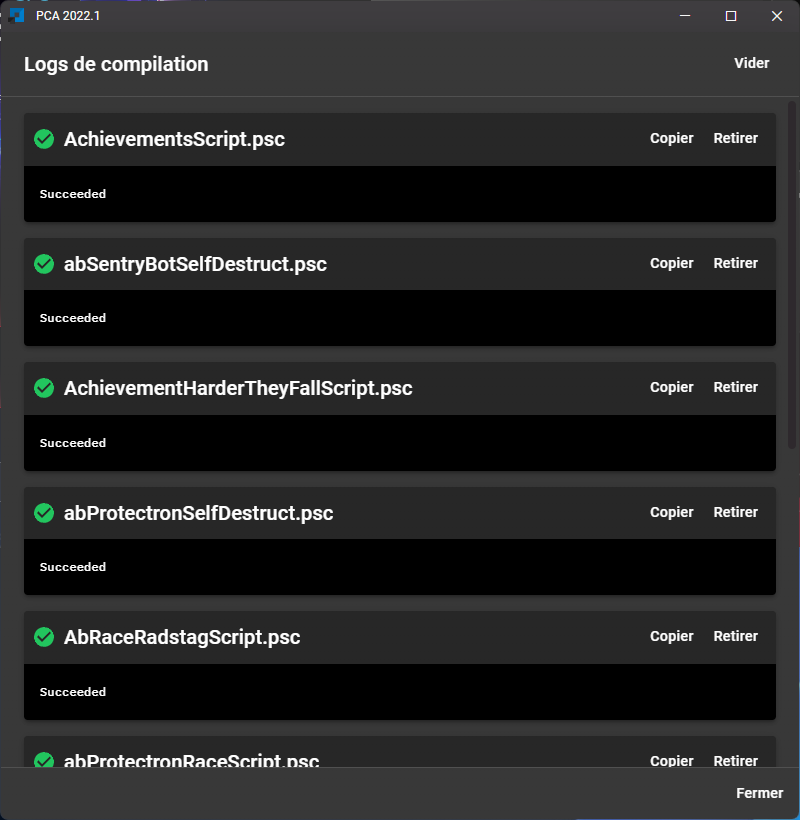
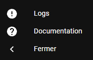
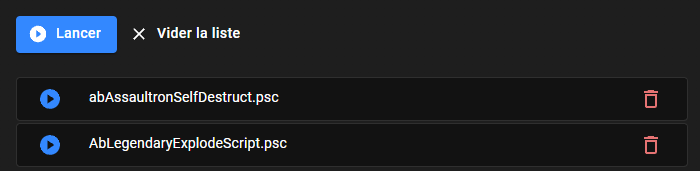
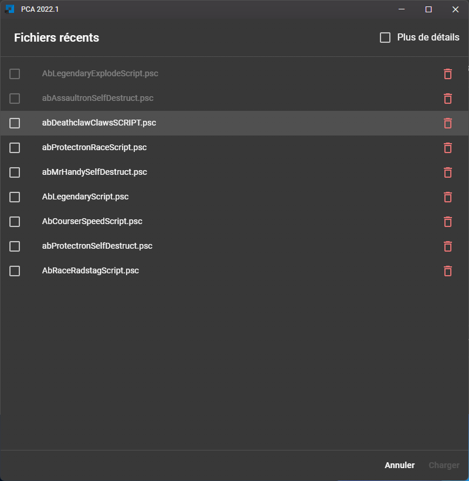

import GithubIssue from "../../src/components/GithubIssue";

# 2022.1

### Bug fixes

- ## **Fallout 4 support**

- When closing the drawer panel, links could break into multiple lines

- Duplicated logs entry

### Features

- New compilation logs view

- Group preview is replaced with a new "more details" button

- New design

- The configuration is now checked when you enter the compilation page, giving you any tips if your configuration is wrong.

- Better mo2 configuration check

- Button to open compilation logs now changes color at the end of a compilation

_Green_: when all scripts compile successfully

_Red_: when a script gone wrong

- New documentation released: access the documentation via NexusMods or with the new button at the bottom left

- You can now compile the script of your choice from the list

- Recent files: option to show the script's full path (<GithubIssue issue="130" />)

- Recent files dialog displays more scripts at once

It is now easier to click on a line

- A loading screen now appear when the application start

- New application titlebar

The application menu is now accessible with the application icon at the left

- The position of the app is now memoized between launchs
- Bumps dependencies
- Changelog window correctly displays images
- The application restarts when resetting the configuration
